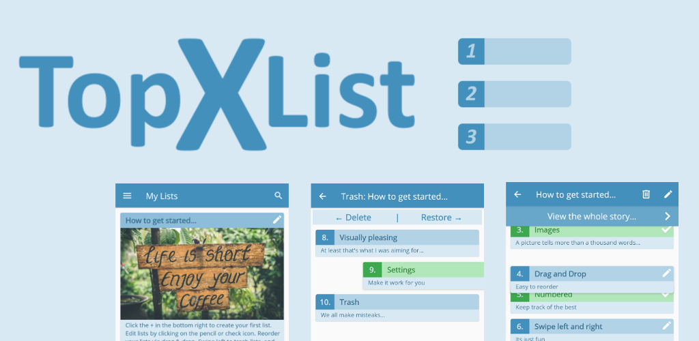
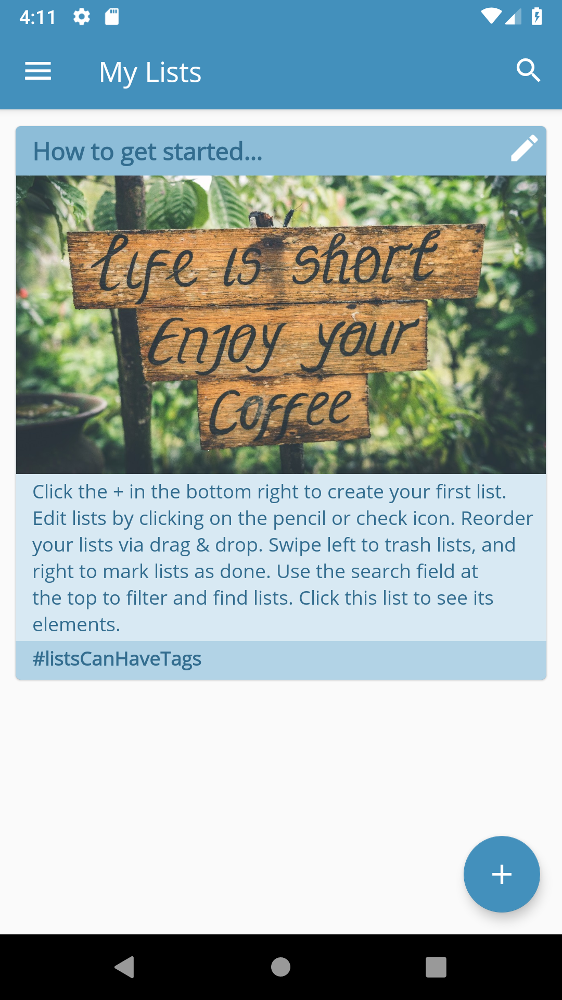
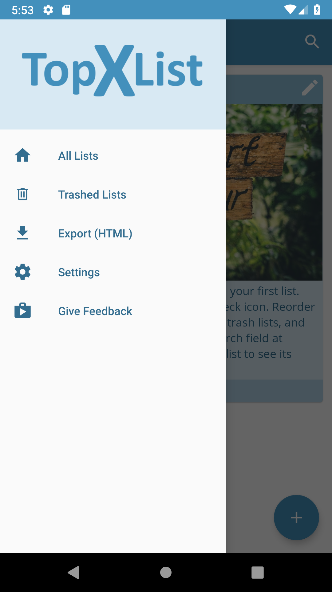
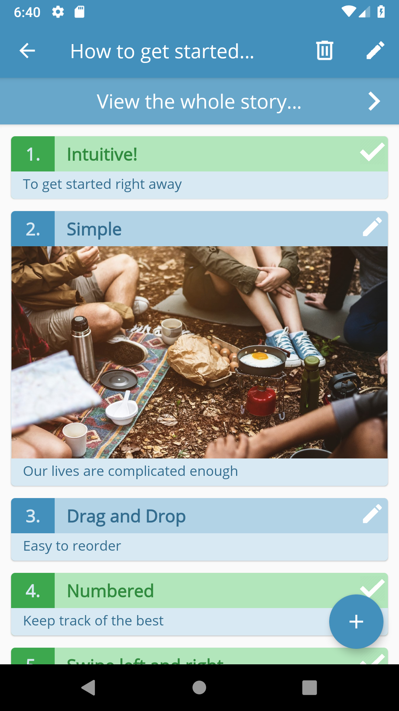
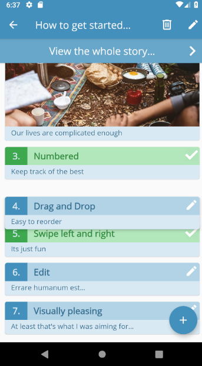
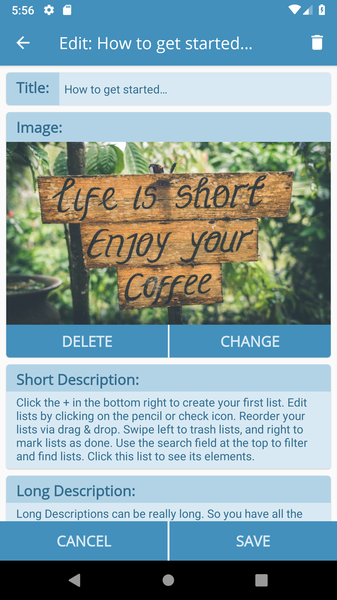
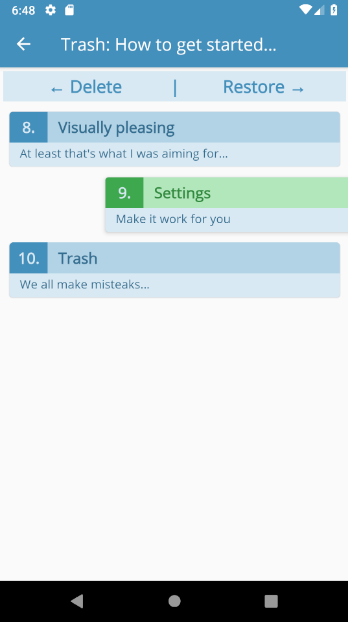
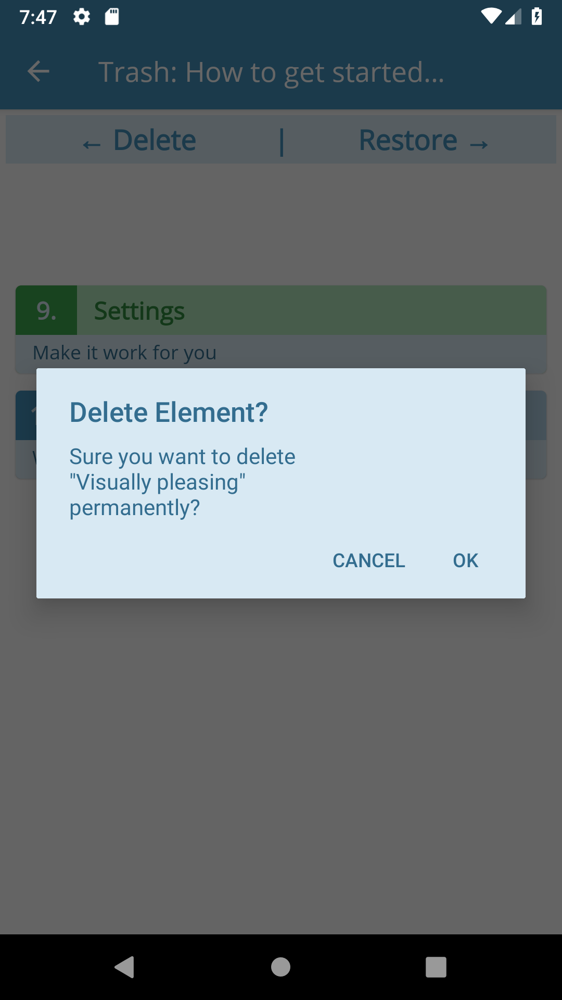
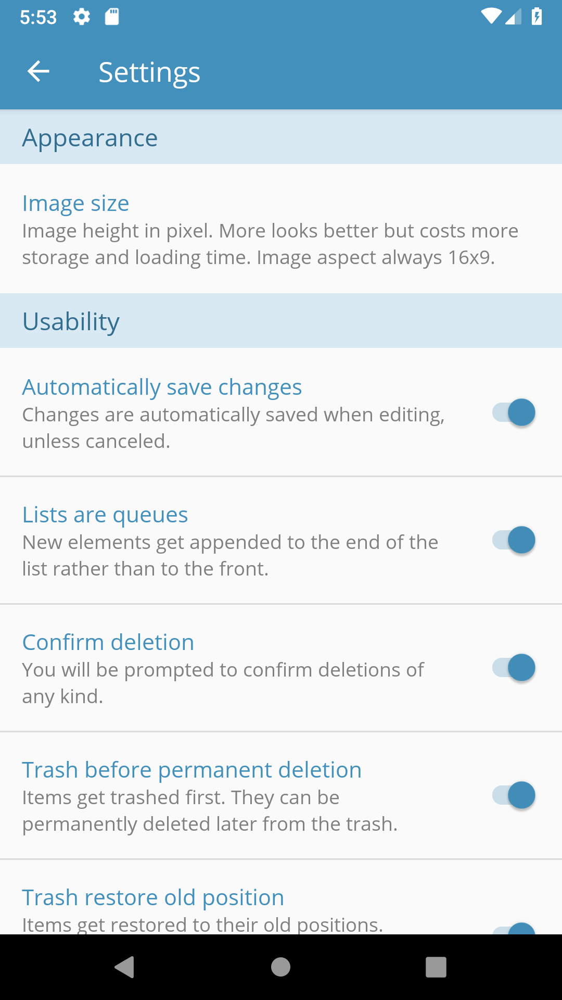

This is the github corresponding to the android app [Top X List](https://play.google.com/store/apps/details?id=com.whynoteasy.topxlist&hl=en). If you have any questions just email me. You can download the app from the play store [here](https://play.google.com/store/apps/details?id=com.whynoteasy.topxlist&hl=en). Hope you like it. ✌️

//Im currently working on the documentation of all the code, so sry about the lack of documentation so far.

## Description:

If you are looking for a useful, intuitive, minimalist app with modern look to maintain a few Top X Lists you have to look no further.

A few use cases would be: The best quotes I have ever heard. Top 10 movies I have ever seen. 20 things I want to do in my holidays. Some notes for my next poem.

## Features include:
* Create, Delete & Edit numbered lists
* Reorder via Drag & Drop
* Delete or Mark done by swiping left or right
* Trash lists and restore them later
* Add images to lists
* Setting for image size and other usability settings
* Export to HTML

## Screenshots:

   
  
 

## Concept to the project

I was looking for an app for android that was visually appealing and would allow me the make an arbitrary number of numbered/ranked/ordered lists where each list could have an arbitrary number of elements. I also wanted to give basic descriptions and tags to the lists and its elements to be able to give a wholistic view of the list and its intention, also the for all its elements.

## Todos 

* **Properly document all classes and the whole project**
* Delete initial images (of example list) 
* Instead of prompting the user on entering an already existing name for a new card, just add index: name-(index)
* Handle updating of xElem and xList positions more elegantly (maybe in the onDestroy methods (exit) of the activities/fragments (if searchbar wasnt active))
* Make ElemViewHolder and ListViewHolder Classes encapsulated !
* Show snack bar consistently on deletion or restoration of xElements and xLists (currently sometimes SnackBar overlaps the FloatingActionButton)
* Add tick in task-bar instead of marked button in Edit Activities
* [BUG] - Title is cut off because its too long in list Views
* [BUG] - In SDK <=19 the padding on the edges of cardViews is weird and elevation stops working (elevation doesnt work due to SDK version, however, padding should work)
* [BUG] - Can choose non image for cropping (no possible to fix by me I think)

## Possible Features (priorities)

* Add better tablet support
* Add better device rotation support (in more Activities than the ImageFullscreen Activities)
* Allow online cloud backups
* Implement online list sharing functionality
* (1) Export html with images
* (2) Export sql database with images zipped
* Support thems and color palettes
* Link to privacy policy from app
* Sort lists based on date of creation, number of elements, percent done of elements, etc.
* Setting to not show marked (done) elements

## Licence

[MIT](LICENCE)
